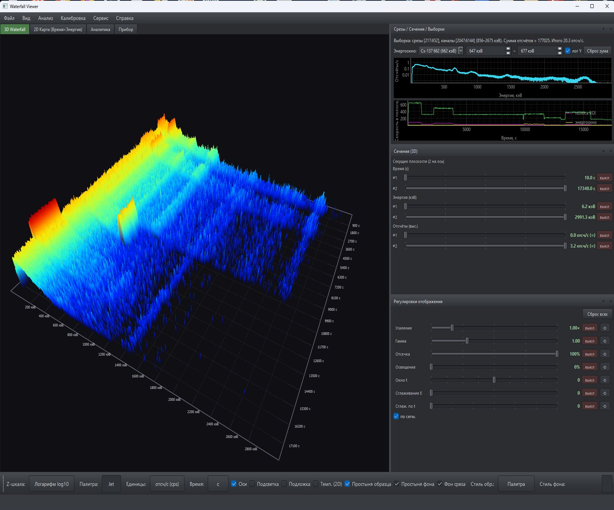
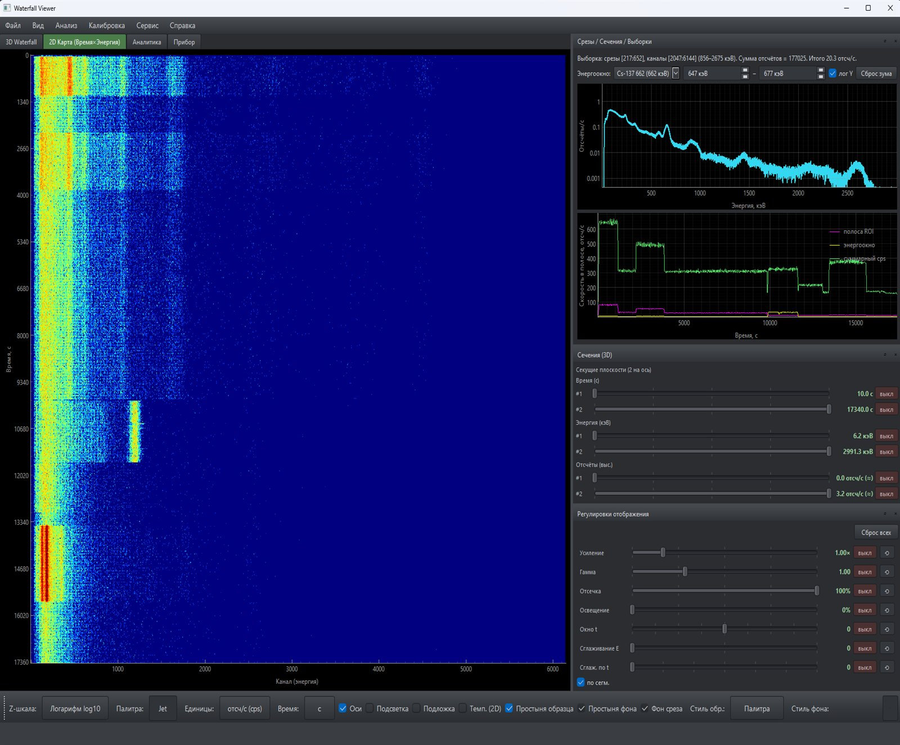

# Waterfall Viewer

A viewer and analyzer for **waterfall spectrograms** from gamma-ray spectrometers: a long recording
(a day-long log, tens of thousands of spectra) unfolds into a 3D surface and a 2D **Time × Energy**
map, where a short activity spike or a background drift is visible at once — without scrolling
through hundreds of spectra by hand. Any moment of the recording expands into an ordinary spectrum;
any energy line — into a plot of its evolution over time.



**Supported formats:** AtomSpectra (`.aswf`, native binary waterfall, versions **v1–v5** — including
detector temperature, GPS and per-row CRC32), RadiaCode (`.rcspg`, JSON — tested on RadiaCode-110),
and ANSI N42.42-2011 (`.n42`/`.xml`). Energy calibration is read directly from the file (polynomial
from the `.aswf` header / `coefficients` / `CoefficientValues`).

 -green)   

## Description & Documentation

| What | Where |
|---|---|
| **Program overview and the whole tool family** (illustrated showcase) | [vibeengineering-llc.github.io/demo-web-pages/atomspectra-waterfall-family](https://vibeengineering-llc.github.io/demo-web-pages/atomspectra-waterfall-family/) |
| **Built-in help** — 15 sections covering every feature | in the app: menu **Help → Help** |
| **Installation from scratch** (no Python experience) | [`INSTALL.en.md`](INSTALL.en.md) |
| **`.aswf` data format** (v1–v5 specification) | [ASWF_FORMAT.md](https://github.com/VibeEngineering-LLC/atomspectra-waterfall-esp32/blob/main/ASWF_FORMAT.md) |
| **Known issues & compatibility** | [`KNOWN_ISSUES.md`](docs/dev/KNOWN_ISSUES.md) |
| **Ready-to-run builds (Windows exe)** | [Releases](https://github.com/VibeEngineering-LLC/waterfall-viewer/releases/latest) |

Data source device: [atomspectra-waterfall-esp32](https://github.com/VibeEngineering-LLC/atomspectra-waterfall-esp32) (WiFi gateway of the spectrometer).
Architectural inspiration — [InterSpec (Sandia)](https://github.com/sandialabs/interspec).

## Features

**Spectrogram viewing**

- **3D surface** Time × Energy × Counts (OpenGL, rotate LMB, zoom wheel, pan MMB), cutting planes
  by time / energy / counts.
- **2D map** Time × Energy with rectangular ROI selection and palettes (Jet, etc.).
- **Z-scale** — contrast switch (linear / √ / log10) for both the 2D map and 3D relief; gain,
  gamma, clipping, lighting and smoothing adjustments.

**Analysis**

- **Time slices** — spectrum of the selected time slice.
- **Cross-sections (by channel/band)** — time series of intensity in a selected energy band
  (energy window with line presets, e.g. Cs-137 662 keV), total-cps curve.
- **ROI selections** — spectrum of the time window + time series of the band + total counts in a rectangle.
- **Nuclide library** — select a nuclide/family (21 nuclides, LSRM SpectraLine data) to highlight
  gamma-line energies with vertical markers; intensity filter included.
- **Analytics** — peak search and identification, FWHM(E), background/MDA, decay-chain analysis.

**Instrument data** (the "Instrument" tab)

- Plots of **dose rate** (µSv/h) and **detector temperature** (°C) over time, with time-unit
  switching (s / min / h).
- **GPS track** — route points colored by count rate; **CSV export** of all series.
- **Temperature overlay** on the 2D map (toggleable).

**Integrity & robustness**

- **Integrity report** on file open: number of slices/channels, total counts, duration, **per-row
  CRC32 check** (ASWF v4/v5), format version, presence of instrument data; can be saved to `.txt`.
- **Unlimited scale** — day-long recordings (tens of thousands of slices) are loaded streaming
  (`lxml.iterparse`, bounded memory); 3D and 2D are rendered via LOD downsampling (`Spectrogram.downsample`).



## Download Ready-to-Run Distribution

**Pre-built Windows executable** — available on the [Releases](https://github.com/VibeEngineering-LLC/waterfall-viewer/releases/latest) page.  
Download `waterfall-viewer-vX.Y.Z-windows-x64.zip`, extract, and run `waterfall-viewer/waterfall-viewer.exe`.  
No Python required.

## Installation from Source

> Step-by-step installation from scratch (no Python experience required) — see [`INSTALL.en.md`](INSTALL.en.md).
> Known issues and compatibility — see [`KNOWN_ISSUES.md`](docs/dev/KNOWN_ISSUES.md).

**Option A — venv (isolated, recommended):**

```bat
cd "path\to\waterfall-viewer"
python -m venv .venv
.venv\Scripts\python.exe -m pip install -r requirements.txt
```

**Option B — global (no venv):**

```bat
py -3.14 -m pip install -r requirements.txt
```

**Easiest — just run `run.bat`:** on first launch it automatically installs missing dependencies
into the user `site-packages` (`pip install --user`, no admin rights needed) and then opens the
app. First run takes ~1 minute due to installation (`Installing dependencies on first run...`
appears in the console). Manual installation (Options A/B above) is only needed if you want an
isolated `.venv` or auto-install is unavailable (no network).

`run.bat` picks the interpreter automatically: if `.venv` exists it uses it; otherwise falls back
to the global Python 3.14.

## Running

```bat
run.bat                                 REM empty window, open a file via menu
run.bat "C:\path\to\waterfall.n42"     REM open a file immediately
```

or directly:

```bat
.venv\Scripts\python.exe -m awf "C:\path\to\file.n42"
```

## Controls

| Action | How |
|---|---|
| Open file | Menu **File → Open…** (Ctrl+O) |
| Integrity report | Shown on open; again via **File → Integrity report…** |
| Rotate 3D | Left mouse button + drag |
| Zoom 3D | Mouse scroll wheel |
| Pan 3D | Middle mouse button |
| ROI selection | Tab **2D Map** → drag the yellow rectangle; slice panels on the right update live |
| Z-scale | Toolbar **View → Z-scale** (linear / √ / log10) — changes 2D and 3D contrast |
| Nuclides | Dock **Nuclide library** (left) → check nuclides; line energies are highlighted on the spectrum plot |
| Instrument data | Tab **Instrument** — dose, temperature, GPS, CSV export |
| Time units | Toolbar **Time:** (s / min / h) — synced across all plots |
| Temperature on 2D | Toolbar **Temp. (2D)** — overlay the temperature line on the map |

## Architecture

```
awf/
  model/spectrogram.py   — numerical core: Calibration (polynomial), Spectrogram
                           (slices, sections, ROI sums, LOD downsample, dose/temperature/GPS). No Qt.
  io/aswf_loader.py       — AtomSpectra loader (.aswf v1–v5): ASWF magic + JSON header +
                           self-describing row_fields; RLE, baseline, per-row CRC32, temperature.
  io/n42_loader.py       — streaming N42 loader (CountedZeroes decoder; iterparse for day-long files).
  io/rcspg_loader.py     — RadiaCode loader (.rcspg, JSON): pulses→counts, calib from coefficients.
  io/nuclide_lib.py      — nuclide library: LSRM .lib parser (win-1251 XML) + our JSON loader.
  data/nuclides.json     — built-in library (21 nuclides, gamma-line energies/intensities).
  analysis/              — peak search/identification (curve_fit), deconvolution, decay chains, MDA.
  ui/view3d.py           — Waterfall3DView (GLViewWidget + GLSurfacePlotItem).
  ui/panels.py           — HeatmapPanel (2D + ROI + temperature overlay), SlicePanel (spectrum + series + markers).
  ui/device_data_panel.py— "Instrument" tab (dose/temperature/GPS + CSV).
  ui/integrity_dialog.py — integrity report dialog (CRC32).
  ui/nuclide_panel.py    — NuclidePanel (nuclide/family selection, intensity filter).
  ui/zscale.py           — shared apply_z_scale (linear/sqrt/log10) for 2D and 3D.
  ui/main_window.py      — MainWindow + background loading (QThread).
  __main__.py            — entry point (python -m awf).
```

The numerical core is decoupled from the UI: it can be tested and used without a display.

## Tests

The data layer is covered by automated tests (reference values from an independent oracle on
real file bytes):

```bat
.venv\Scripts\python.exe -m pytest -q
```

(797 tests: ISO durations, CountedZeroes hand-cases + fuzz vec≡scalar, polynomial calibration,
inverse energy→channel mapping, real sample loading, N42/ASWF v1–v5/RCSPG loaders, per-row CRC32,
temperature/GPS/dose, nuclide library, peak search and identification, decay-chain analysis,
segmentation, i18n, and more.)

Graphical modules are smoke-tested by scripts in `scripts/` (build widgets on a real sample
without GUI interaction).

## Stack

Python 3.12 / 3.14 · numpy · scipy · lxml · PySide6 (Qt) · pyqtgraph + PyOpenGL.

## License

[MIT](LICENSE) © 2026 Verter73.
